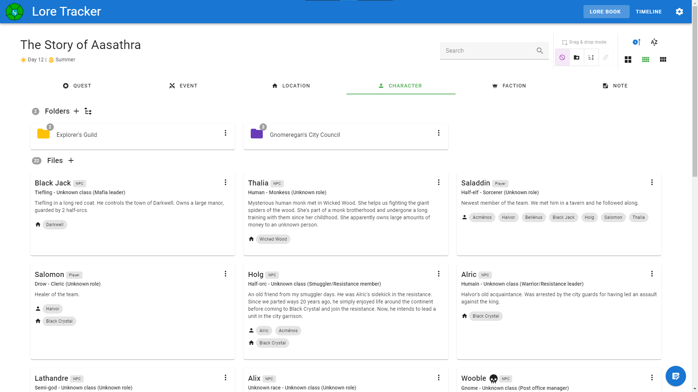
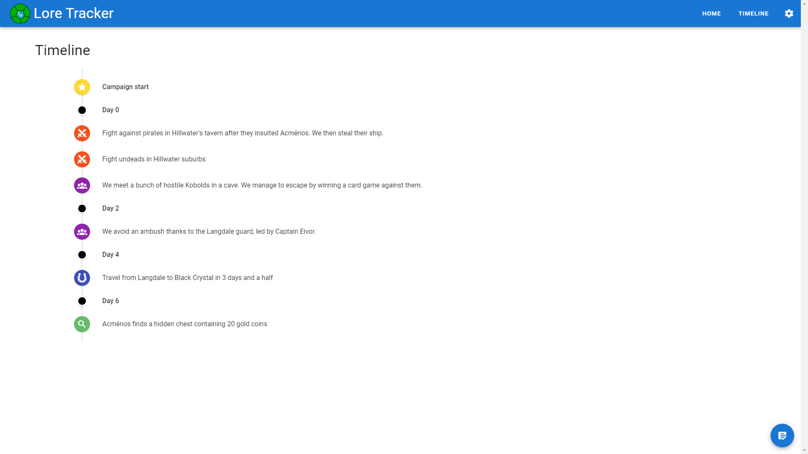

# Lore Tracker

Lore Tracker allows you to easily save, manage and visualise story elements for Table-top RPGs.

You can't remember the name of that NPC you met six months ago ? Lore Tracker has got you covered.



## Features

* Add, edit and delete story elements ("cards") such as Objectives, Events, Locations, Characters... 
* Markdown language support for texts
* Link cards together with tags
* Sort cards with Drag & drop
* Card filtering
* Events visualisation on a timeline
* Light and dark themes
* Navigation hotkeys

*Lore Tracker is only available on Windows 10 for now.*

### Upcoming

* French translation
* Dice roller 


## Dev

This program is written with [Vue.js](https://github.com/vuejs/vue) and embedded in an [Electron](https://www.electronjs.org/) app.

### To setup and run the project

* Project setup
```
npm install
```

* Compile and hot-reload for development
```
npm run electron:serve
```

* Compile and minify for production
```
npm run electron:build
```

## License

This program is licensed under the GNU General Public License v3.0.

© 2021 - const39